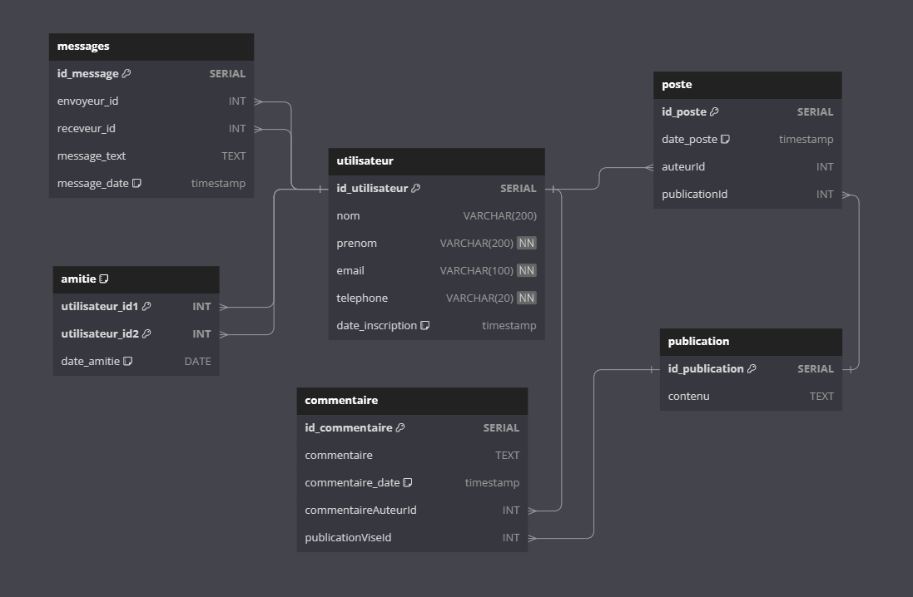
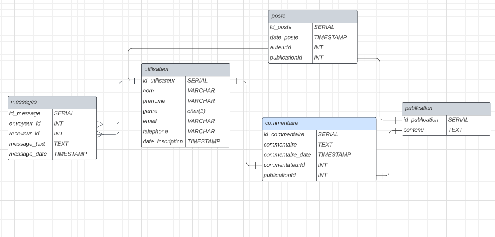

# Réseau social avec SPRINGBOOT CRUD
Ceci est une simple **API REST** de mon projet PROG2 ayant pour thème un réseau social.
---
## A propos
- Ce projet se concentre surtout les opération **CRUD**, c'est à dire qu'il n'y a aucune utilisation de *JPA* dedans.
- On peut aussi y voir dedans la spécification de ce REST dans les ressources en fichier .yaml

### Schema de base de donnée
- Version prototype du mcd

- Version finale du mcd
